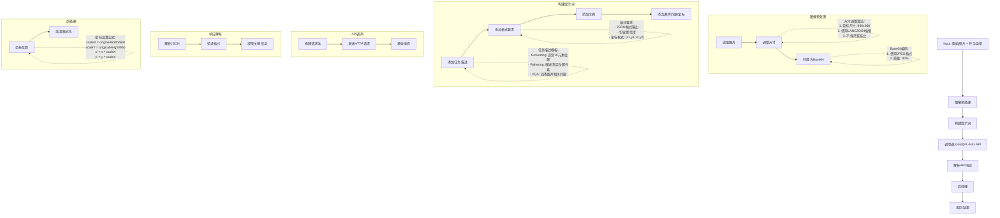

# 语流小助手应用蓝图

## 项目概述
语流小助手是一个基于AI的手机自动操作智能体应用，能够通过理解用户的指令，自动完成一系列复杂的手机操作，实现用户效率和体验的高效提升。

## 核心功能
1. 手机屏幕截图理解
2. 基于理解结果的自动化操作执行
3. 三种测试任务支持（用于验证核心理解能力）：
   - GUI Grounding: 根据用户问题，给出截图上指定控件的位置（绝对坐标）
   - GUI Referring: 根据指定位置信息，回答对应位置的功能或文字描述
   - GUI VQA: 基于屏幕信息的手机意图操作问答（文字+坐标）

## 技术架构
- 图像处理：阿里云通义千问VL-Max API
- 用户界面：MFC框架
- 核心能力：图像理解与自动化操作映射

## 测试数据集
- 共1008张图片，2000个问题
- 三种测试类型用于验证核心功能
- 测试数据用于确认图像理解和格式化输出功能正常工作

## 扩展性设计
- 预留手机自动化操作接口
- 模块化设计便于功能扩展
- 标准化输出格式支持多种应用场景

## 部署说明
- 开发环境：Visual Studio with MFC
- 依赖项：阿里云SDK
- 配置要求：API密钥配置文件

